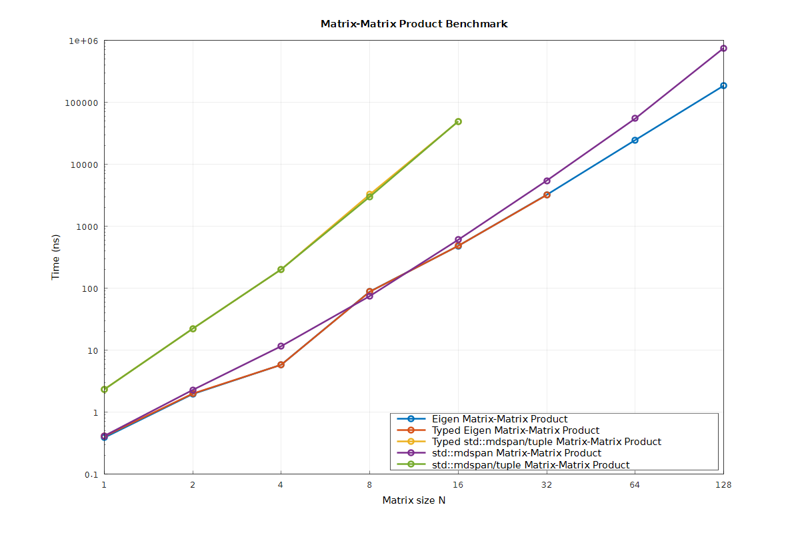

# Benchmarks

Build and run the benchmarks on Windows platform:

```shell
git clone --depth 1 "https://github.com/FrancoisCarouge/TypedLinearAlgebra" "linalg"
Remove-Item -Path build -Force -Recurse
cmake -S "linalg" -B "build" -G "Visual Studio 18 2026" -DBUILD_BENCHMARKING=ON
cmake --build "build" --config "Release" --parallel 1
ctest --test-dir "build" --build-config "Release" --tests-regex "bench" --parallel 1
```

# Results

Disclaimer: naive benchmark results for illustration purposes only.

MSVC 19.50.35728.0



| Title | Size | Median Elapsed Time (s) | Median Absolute Error (%) |
| --- | --- | --- | --- |
| Eigen::Matrix |     1x1     | 3.87771386512016e-10 | 0.00538872883190906 |
| Eigen::Matrix |     2x2     | 2.1351601012727e-09 | 0.00105165925212321 |
| Eigen::Matrix |     4x4     | 5.80896895063472e-09 | 0.00206230836566979 |
| Eigen::Matrix |     8x8     | 8.82150833190173e-08 | 0.00636310746770291 |
| Eigen::Matrix |    16x16    | 4.81609195402299e-07 | 0.00553949572120116 |
| Eigen::Matrix |    32x32    | 3.20642458100559e-06 | 0.00310933918515592 |
| Eigen::Matrix |    64x64    | 2.45040816326531e-05 | 0.00122316643192698 |
| Eigen::Matrix |   128x128   | 0.00018674 | 0.00527562446167087 |
| typed matrix from Eigen::Matrix |     1x1     | 5.80222304380841e-10 | 0.00234271518047659 |
| typed matrix from Eigen::Matrix |     2x2     | 1.95578082670628e-09 | 0.00757158029212781 |
| typed matrix from Eigen::Matrix |     4x4     | 5.82380065620289e-09 | 0.00354615746619045 |
| typed matrix from Eigen::Matrix |     8x8     | 8.79135665664081e-08 | 0.00376541518675338 |
| typed matrix from Eigen::Matrix |    16x16    | 4.81799075241698e-07 | 0.0068258799481259 |
| typed matrix from Eigen::Matrix |    32x32    | 3.18402203856749e-06 | 0.00464654136650976 |
| std::mdspan |     1x1     | 3.9203347453668e-10 | 0.014576617073535 |
| std::mdspan |     2x2     | 2.16613117637008e-09 | 0.00854977222211279 |
| std::mdspan |     4x4     | 1.17157248713773e-08 | 0.00628431019065444 |
| std::mdspan |     8x8     | 7.46247996502987e-08 | 0.00246572419649173 |
| std::mdspan |    16x16    | 6.03748680042239e-07 | 0.00379745275307134 |
| std::mdspan |    32x32    | 5.43271028037383e-06 | 0.00252122924297414 |
| std::mdspan |    64x64    | 5.45894736842105e-05 | 0.00250048086170408 |
| std::mdspan |   128x128   | 0.0007067 | 0.00688589094997183 |
| typed matrix from std::mdspan |     1x1     | 4.0251135383016e-10 | 0.0415372123392322 |
| typed matrix from std::mdspan |     2x2     | 2.18066853838217e-09 | 0.00853373531597857 |
| typed matrix from std::mdspan |     4x4     | 1.19625453850564e-08 | 0.00575635449177043 |
| typed matrix from std::mdspan |     8x8     | 7.49313491008947e-08 | 0.00280541684762946 |
| typed matrix from std::mdspan |    16x16    | 6.03710247349823e-07 | 0.00263030856332186 |
| typed matrix from std::mdspan |    32x32    | 5.46612903225806e-06 | 0.00490970365005946 |
| std::mdspan from std::tuple |     1x1     | 2.33409641032824e-09 | 0.00461088654682818 |
| std::mdspan from std::tuple |     2x2     | 2.22298122503053e-08 | 0.00130157821595603 |
| std::mdspan from std::tuple |     4x4     | 2.01255539143279e-07 | 0.00106235441111578 |
| std::mdspan from std::tuple |     8x8     | 2.94166666666667e-06 | 0.00749697894803798 |
| std::mdspan from std::tuple |    16x16    | 4.92409090909091e-05 | 0.00248094125941906 |
| typed matrix from std::mdspan from std::tuple |     1x1     | 2.33872770351826e-09 | 0.00737212389527389 |
| typed matrix from std::mdspan from std::tuple |     2x2     | 2.22671644886953e-08 | 0.00292630696616741 |
| typed matrix from std::mdspan from std::tuple |     4x4     | 2.01591668304185e-07 | 0.0038063912684703 |
| typed matrix from std::mdspan from std::tuple |     8x8     | 3.23577464788732e-06 | 0.00523916174533996 |
| typed matrix from std::mdspan from std::tuple |    16x16    | 4.88857142857143e-05 | 0.00247095985327078 |
