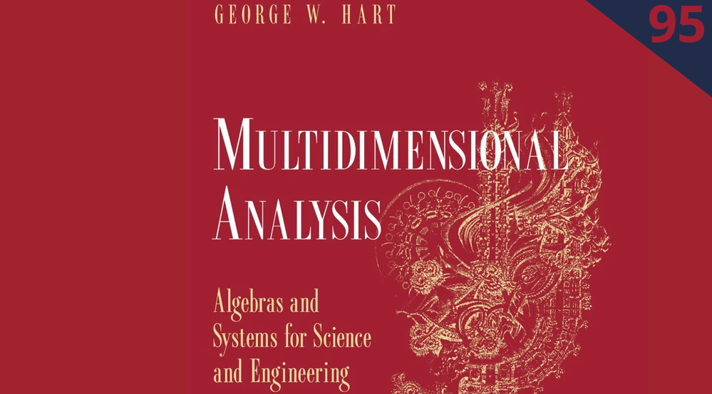
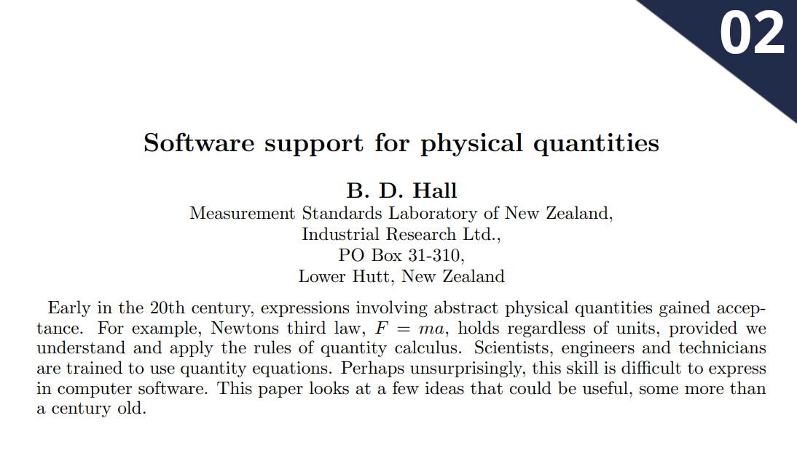
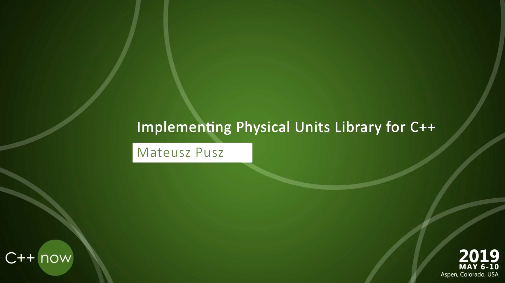
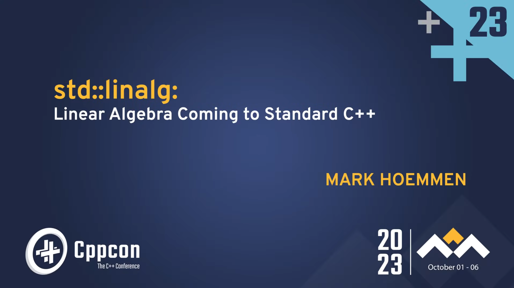
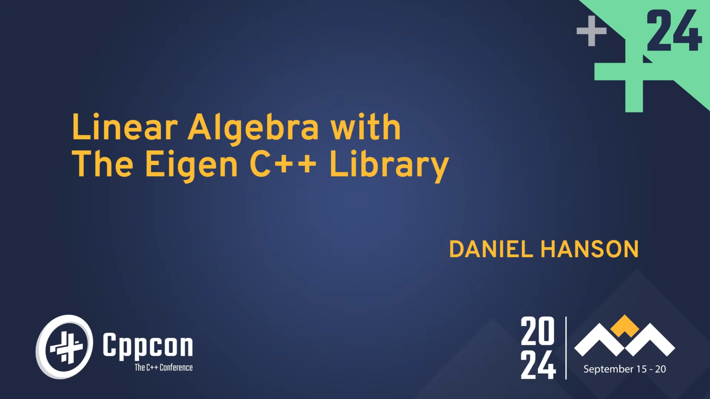
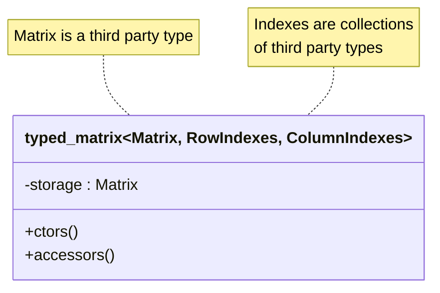
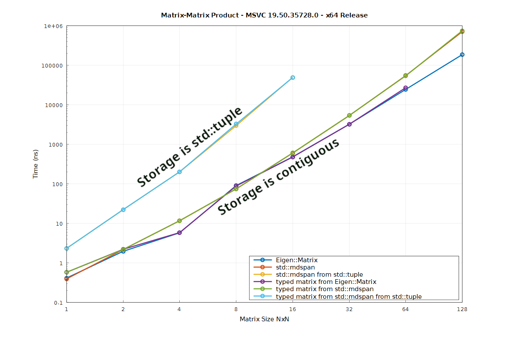
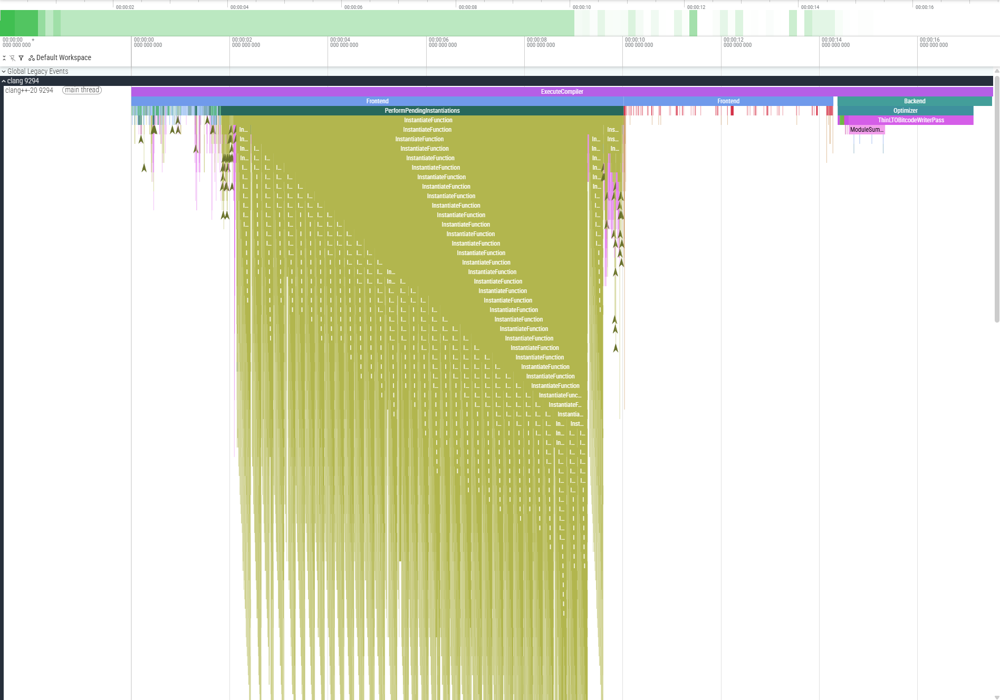

<section data-background-image="welcome.png" data-background-size="contain">
<aside class="notes">
Typed Linear Algebra
How to Not Crash on Mars
Hello, my name is François Carouge. Thank you for welcoming me to present in this session of Cpp Bay Area.<br />
Today we are going to talk about yet another type of safety in programming languages. That would be quantity or unit safety with support of the C++ type system. We will try to implement unit safety in linear algebra applications. My objective is to share with you my practical learnings about type safe matrices. I will motivate the problem, explore the ideas, introduce a solution, and share takeaways.<br />
As-is customary at CppNow, please interrupt me with your questions, or note down the slide number if you prefer to bring it up during the Q&A. Let us start today with a real-world, motivating problem.
</aside>
</section>

---

<section data-background-image="jnj.png" data-background-size="contain">
<aside class="notes">
I would like to thank my employer Johnson & Johnson MedTech for supporting my attendance at this conference. We provide an inclusive work environment to service our patients and communities. The opinions expressed are my own and do not reflect the views of my employer. We make remarkable robots and we are hiring. 
</aside>
</section>

---


<aside class="notes">
<b>Do you know which launch this is?</b><br />
Yes, it is the December 1998 launch of the Mars Climate Orbiter probe. The mission lasted 286 days for 327 million dollars. <b>And do you know how the mission concluded?</b><br />
Yes, the program litteraly crashed, a mission failure, the Mars Climate Orbiter probe was lost to Mars. The cause of the loss was an incorrect entry trajectory, 169 kilometers too close to Mars surface. The cause of the incorrect trajectory was one software producing impulse vector results in pound-force seconds, while the results fed to another software taking input in newton seconds. The unit difference meant an error factor of 4.45. The producing software did not meet the interface specifications. The specification, and then implementation, defect escaped to production due to additional causes including but not limited to, the lack of testing, verification, and validation, all contributed by economical pressure.<br />
I will let you decide on the tradeoffs for yourself and your projects if you care to catch this type of errors at compile-time. If you care, the problem for this talk is the: how to build a strongly typed linear algebra library: its data structures, vectors, matrices; and its algorithms.
</aside>

---

```cpp
// Built-in types:
double run_duration_seconds{42.};
double building_height_meters{99.};
```

<span class="fragment">

```cpp
// Unit types:
std::chrono::seconds run_duration{42.}
quantity building_height{99. * m};
```

</span>

<aside class="notes">
You may have seen code that uses the built-in types to represent entities with additional meaning: the duration of a run in seconds or the height of building in meters. The semantic of the variable is not encoded in its type. It is sometimes implicitely attached to the variable in its name. Or it is sometimes described in a comment somewhere. Or sometimes relies on the implicit convention of systematic usage of the international system of units in a code base such that units are rarely identified explicitely. All of our tools struggle to protect users from invalid operations such as assiging the time value to the building height variable. Only built-in implicit type conversion are protected with compiler flags. And without external controls, resulting defects may end up crashing, on Mars.<br />
FRAGMENT<br />
More recently, I hope you might have seen code that encodes the units, dimensions in the type system itself. Here the invalid conversions, operations result in compiler errors, guiding the developers. Other benefits also include shorter variable names for readability. The type provides context. There exists a variety of dimension libraries in C++, an example is that of `std::chrono` or other standardization efforts such as Mateusz Pusz's mp-units library and its quantity type. We will use the mp-units quantity type in our examples today.
</aside>

---

```cpp
// Vector with built-in types:
vector v0{1., 2., 3.};
// std::vector<double>
// std::span<double, 3>
// Eigen::Vector<double, 3>
```

<span class="fragment">

```cpp
// Vector with unit types:
vector v0{1. * m, 2. * m, 3. * m};
// std::vector<quantity<m>>
// std::span<quantity<m>, 3> ?
// Eigen::Vector<quantity<m>, 3> ??
```

</span>

<span class="fragment">

```cpp
// Do as the built-in types?  double * double = double 🗸
//                            length * length = area   𐄂
```

</span>

<aside class="notes">
There exists a variety of linear algebra libraries in C++: the C++26 `std::linalg` combined with the C++23 `std::mdspan`, or higher order libraries such as Eigen. We will use the Eigen types in our examples today. A common data structure type found in linear algebra is that of a colum vector, we will call that a vector. Traditional representations of a linear algebra vector can be made with `std::vector`, C-arrays, `std::span`, or an `Eigen::Vector`. Tradeoffs exists for sizes known at compile-time or at run-time, owned memory or views over a range, and linear algebra operations availability.<br />
FRAGMENT<br />
This second block of code shows what could be a first attempt at typed linear algebra by using the quantity types in place of the built-in types. Unfortunately all linear algebra operations and libraries have been designed with assumptions of built-in types. These assumptions do not hold for types with additional semantic. The built-in types are only representations of data, almost no semantic.<br />
FRAGMENT<br />
For example, a double multiplied by a double gives you a double, but a length multiplied by a length gives you an area, even though both length and area are represented by an underlying double. Linear algebra operations soon fail to compile with the strongly typed vectors. Some approaches heavily modified the linear algebra libraries to support the strong types although it is a large effort.
</aside>

---

```cpp
// Vector with heterogeneous unit types:
vector v0{1. * m, 2. * m / s, 3. * m / s2};
// vector type?
```

<span class="fragment">

```cpp
// Matrix with heterogeneous unit types:
matrix m0{{1. * m,     2. * m / s },
          {3. * m / s, 1. * m / s2}};
// matrix type??? 
```

</span>

<aside class="notes">
More difficulties arise when the linear algebra vectors have heterogenous types. You can store the heterogenous type in a `std::tuple`. What about the linear algebra operations? The existing linear algebra libraries are simply not equipped to allow such idiomatic code.<br />
FRAGMENT<br />
And finally, C++ itself does not permit the constuction of multi-dimensional heterogenous initializer-lists without additional syntaxic sugar. Heterogenous initializer-lists had a tendency to trigger internal compiler errors. <b>What do you think? Can we still design strongly typed linear algebra using yet another level of indirection?</b><br />
The idea is to use an abstraction, necessarily zero-cost, to provide to the user a composition of strong types and linear algebra. And down the rabbit hole of template metaprogramming we may go.
</aside>

---









<aside class="notes">
Before I detail these references that helped me prepare this library: <b>Who is familiar with the 1878 Bertrand-Buckingham π theorem?</b> The theorem proves linear systems can be rewritten in terms of a set of dimensionless parameters. So technically we could always transform the linear systems to use dimensionless parameters. Unfortunately usage in implementation is hardly systematic. Anyway the theorem does not help in exchanging physical algebraic information through software interfaces. The Bertrand-Buckingham π theorem is insufficient.<br />
In 1995 George Hart informed us on the mathematical properties of dimensioned quantities. In 2002 Blair Hall identified conceptual elements of physical quantities applied to software frameworks. In 2020 Mateusz Pusz presented a C++ physical unit library. In 2021 Chip Hogg shared C++ lessons about units in matrices. In 2022 Daniel Withopf formalized a C++ physical unit matrix. In 2023 Mark Hoemmen presented C++26 std::linalg based on a subset of the BLAS standard. In 2024 Daniel Hanson showed us interoperability of Eigen and std::linalg.<br />
Daniel Withopf and Chip Hogg informed us there already exists several closed-source, proprietary typed linear algebra implementations. And we can even find various open-source typed linear algebra attempts over the years. We are trying to make a general, open-source, and permissive typed linear algebra library solution.
</aside>

---

###### Objective

```cpp
// Update the estimate uncertainty of a Kalman filter:
p = (i - k * h) * p * t(i - k * h) + k * r * t(k);

std::println("{}", p);
// [[8.92 m²,      5.95 m²/s,    1.98 m²/s²],
//  [5.95 m²/s,  503.98 m²/s², 334.67 m²/s³],
//  [1.98 m²/s², 334.67 m²/s³, 444.91 m²/s⁴]]
```

<aside class="notes">
I author a Kalman filter C++ library. Briefly, the Kalman filter is a control theory tool applicable to signal estimation, sensor fusion, or data assimilation problems. This sample shows an implementation of the estimate uncertainty update of a Kalman filter. It is simple, yet non-trivial. A fair benchmark, objective for today. The estimate uncertainty P shown with its nine values comes from the estimation of the position, velocity, and acceleration of an object in one-dimension. There exists filters with dozens, hundreds, or more states. Filters with numerous states can get complicated. Development difficulties and safety risk arise in ensuring a parameter is used in the expected position and with the expected units. This was my motivation for the typed linear algebra library.
</aside>

---



<aside class="notes">
I propose the `typed_matrix` class to compose a third party linear algebra matrix type. This matrix type is injected through a template parameter `Matrix`. This Matrix parameter and its usage nay need to transparently accomodate expression templates techniques which permits compile-time reduction of complex linear algebra expressions. I propose not to limit memory model to ownership or view but to support both. It is perhaps less common in C++. The strong types of the matrix elements are encoded in a collections of types. <b>What do you use for collections of types?</b><br />
Packs? Template template parameters? `std::tuple` may suffice. <b>Why are there two collections of types? Isn't one collection of N-times-M types sufficient to encode all the individual types of the matrix?</b><br />
It interestingly turns out that encoding N-times-M types is quite complicated and also unecesary. Blair Hall explained a conjecture from George Hart on the properties of physical quantity linear algebra: that is for all useful physical matrices N-plus-M types suffices to represent all the valid types of the matrix. Hence we will use two collections: one for the rows, one for the columns; the element of any given type being a factor at the intersection. Additionaly, the typed_matrix must also support the superset of operations provided by the third partly linear algebra libraries and the standard library. Lastly, the library needs to be decoupled from the linear algebra library and element type libraries. The template parameters, concepts, customization point as template specialization will help us in decoupling the dependencies.
</aside>

---

```cpp
template <typename Matrix,
          typename RowIndexes,
          typename ColumnIndexes>
class typed_matrix {
```

###### Some Public Member Types

<span class="fragment">

```cpp
// [i-th, j-th] element type:
template <int RowIndex,
          int ColumnIndex>
using element =
  product<std::tuple_element_t<RowIndex,
                               typename Matrix::row_indexes,
          std::tuple_element_t<ColumnIndex,
                              typename Matrix::column_indexes>>;
```

</span>

<aside class="notes">
We declare the `typed_matrix` class with its three template parameters. These template parameters are also available as member types, not shown here in this class declaration since they are merely aliases.<br />
FRAGMENT<br />
An interesting member type is the template element type. The strong type of the i-th, j-th element, for example the velocity in meter per seconds from the quantity library. The resulting type is formed by the result type of product of the i-th type of the row indexes by the j-th type of the column indexes. Importantly, note that the product template used here is not equivalent to the `std::multiplies` functional structure of the standard library. It is instead the resulting type of a multiplication that respect the strong types: the product of two lengths is an area. This is an example of the standard library not considering strong type semantic results. This alternative product type here is implemented in terms of the resulting type from invoking the call operator of a specialized multiplication structure. These abstractions allow for template specializations to resolve the varied use cases of template product types such as the general N-by-M case or decayed use cases for vectors or singleton matrices. As an astute observer you may have noted the product of types may not directly support jacobian or information matrices seen in previous approaches. We leave this important detail aside today.
</aside>

---

###### Some Member Variables

```cpp
// Sizes are static inline constexpr:
int rows    = std::tuple_size_v<row_indexes>;
int columns = std::tuple_size_v<column_indexes>;

private:
// Underlying algebraic backend:
Matrix storage;
```

<aside class="notes">
The count of rows and columns will be useful as public member variables. And the rank, or dimension of the matrix, not shown here.
These members are static inline constexpr. We will omit all attribtutes (constexpr, nodiscard, and the occasional `std::remove_cvref_t`) in the slideware today for readability. The code is also slightly simplified at times, see the library on GitHub for the details. Please, mentally fill in attributes as we go. We will also not deal with dynamically sized matrices today.
</aside>

---

###### Some Constructors

```cpp
// Safe default:
typed_matrix()
  requires std::default_initializable<Matrix>;

// Compatible copy conversion:
typed_matrix(const same_as_typed_matrix auto &other);

// Singleton matrix from convertible value.
typed_matrix(
    const std::convertible_to<element<>> auto &value)
  requires singleton_typed_matrix<typed_matrix>;
```

<aside class="notes">
The destructor is not shown here. You can imagine a default constexpr destructor.
Neither I will show the copy- and move- assignment operators equivalent to these constructors.
Most matrice libraries made the choice of an unitialized default constructor for historical or performance reason. For a safer linear algebra library, it is appropriate to have a zero-initialized default constructor if the type-erased third party matrix type supports a default initialization. The implementation, not shown here, ensures zero-initialization.
The compatible copy conversion provide support for safely convertible but not strictly identical typed matrix. One example is that of a matrix where the rows and indexes types are merely transposed. Another example is that of the element types represent the same physical quantity type but the C++ template are not quite identical. Similarly for compatible move conversion. 
The singleton constructor helps the typed matrix to behavior more like built-in types where it can.
</aside>

---

```cpp
// Uniformly typed vector from array:
typed_matrix(const element<> (&elements)[rows * columns])
  requires uniform_typed_matrix<typed_matrix>
       and one_dimension_typed_matrix<typed_matrix>;

// Uniformly typed matrix from init-list of init-lists:
template <typename Type>
typed_matrix(
    std::initializer_list<std::initializer_list<Type>> row_list)
  requires uniform_typed_matrix<typed_matrix>;
```

<aside class="notes">
The constructor from an array is valid for uniform vectors.
We can at least provide a constructor accepting an initializer-list of initializer-list for a type giving a uniformly typed matrix.
</aside>


---

```cpp
// Vector from values:
typed_matrix(const auto &first_value,
             const auto &second_value,
             const auto &...values)
  requires one_dimension_typed_matrix<typed_matrix>;

// ! Underlying matrix conversion:
explicit typed_matrix(const Matrix &other);
```

<aside class="notes">
And we can also provide an easy construction for a column or row vector of heterogeneous quantities. Note the parameter pack with two preceding mandatory parameter to disambiguate from other constructors.
The last constructor is a sharp edge. The tradeoffs are not always easy and so we may need to be able to construct a typed matrix from its underlying matrix type. This is helpful for implementing operations without friendship, or supporting expression templates. This is a problem.
</aside>

---

###### Some Concepts

```cpp
// A typed matrix concept:
template <typename Type> concept same_as_typed_matrix =
  std::same_as<Type, typed_matrix<typename Type::matrix,
                                  typename Type::row_indexes,
                                  typename Type::column_indexes>>;
```

</span>
<span class="fragment">

```cpp
// A uniformly typed matrix concept:
template <typename Type> concept uniform_typed_matrix = // ...
  // is a typed matrix, and
  // each element are of the same type.
```

</span>

<aside class="notes">
The constructors of the typed matrix used concepts to ensure they are meanigful for a given template instantiation of a typed matrix. We show here a couple interesting concepts among the the 10 or so concepts present and used in the library.
In some cases, we want to enable behavior solely for typed matrices. This concept presented with an interesting challenge in its definition: the template parameters of the typed matrix could not be passed in the concept nor deduced. The neat idiom to permit usage of the concept while passing only the single type to check was to re-use the type's under evaluation for its member types. Note the Type parameter is found on both sides of the same type concept.<br />
FRAGMENT<br />
There will be constructors, members that are only valid, only enabled if the typed matrix is in the special case of a uniformely typed matrix. All element types are the same. The same? Is same type too restrictive? Wouldn't convertible types be a sufficient condition? But convertible to what? A common type? To one another? Exhaustively? Some questions remain open. Also note that the constexpr for or template for expression statement can often be re-written as a fold expression, we haven't found a practical nested fold expression equivalent to the nested for loops here. Note that in C++26 template for expansion statement will replace these constexpr for templates. 
</aside>

---

###### Some Accessors

```cpp
// Compile-time bound-checked typed element read/write:
template <auto... Indexes>
decltype(auto) at(this auto &&self)
  requires(sizeof...(Indexes) >= rank);

// ! Subscript operator access:
template <typename... Indexes>
decltype(auto) operator[](this auto &&self, Indexes... indexes)
  requires(sizeof...(Indexes) >= rank)
       and((index<Indexes> && ...)
        or uniform_typed_matrix<typed_matrix>);
```

<span class="fragment">

```cpp
}; // typed_matrix
```

</span>

<aside class="notes">
It seems the best we can do for type-safe compile-time bound-checked access is the standard `at` member, providing the i-th, j-th position as non-type template parameters.
Next is the subscript operator, another sharp edge, here we see it with deducing this to deduplicate operators. The example shown here is that of the square bracket index operator. There is also the identical historical parentheses index operator not shown here. One difficulty with this operator is the lack of possibilities to provide compile-time bound checking. Another difficulty is that in C++ the return type is fixed at compile-time. We cannot vary the return type based on the element accessed at runtime. Therefore we limit this syntax to uniform matrices to preserve our type safety. This is a problem. It may be judicious to not support this accessor at all. Similarly for the parentheses-based index access operator not shown here.
FRAGMENT<br />
And that's almost it for typed matrix class declaration, we will then see interesing implementations for some of these members and operations.
</aside>


---

###### Some Algorithms

```cpp
auto operator+      (const same_as_typed_matrix auto &lhs,
                     const same_as_typed_matrix auto &rhs);

auto operator*      (const same_as_typed_matrix auto &lhs,
                     const same_as_typed_matrix auto &rhs);

void matrix_product (const same_as_typed_matrix auto &lhs,
                     const same_as_typed_matrix auto &rhs,
                           same_as_typed_matrix auto &result);

auto transposed     (const same_as_typed_matrix auto &value);

void scale          (const auto &α,
                     same_as_typed_matrix auto &x);
```

<aside class="notes">
Adding algorithms, or operations against the typed matrix is merely done by adding functions. We've made the choice to avoid the friendship coupling to enable extensibility.
The first two operators, the additions, are two overloads among four variations: adding two matrices, and adding a value to a 1-by-1 matrix. There are conditions on the types added, size of the matrix, convetibility of the types.
The matrix-matrix-product operator shown here is the general case product among six other overloads.
The matrix-matrix-divison operator, also has six overloads. It has the particularity to be configurable via yet another customization point object to select the end-user's prefered division implementation from a matrix decomposition solver. Matrix division divides the community. Pun intended. Should it exist? In which cases? Remember linear algebra is not commutative, a matrix may not have an inverse, and there may exists multiple different solutions to the same division.
Should the transposed operation shown here be done in place?
The scale operation, alpha x, done in place here, imposes a dimension-less restriction on the scalar, because the index types of the typed matrix are fixed.
All in all the library wants to provide a drop-in support for both Eigen and `std::linalg` matrix algorithms were possible.
</aside>

---

###### Linear Algebra Layers

<small>

| Layer | Abstraction | Implementation |
| --- | --- | --- |
| High-Level Math | Domain specific | Application |
| Low-level Math | Linear systems, least-squares, eigenvalue | LAPACK, Eigen, Armadillo, MatX |
| Performance Primitives | Vector, matrices, operations & solvers | std::linalg, BLAS |
| Fundamentals | Multidimensional arrays, iteration | std::execution, std::mdspan, std::simd |

</small>

<aside class="notes">
At CppCon 2023 Mark Hoemmen introduced us to `std::linalg` coming to the standard. His talk included an abstraction layer nomenclature that I paraphrased here. On top of the hardware we find the fundamental support, used by performance primitives where specialized performance hardware implementation are reasonable. Themselves used by the low-level linear algebra mathematics which can be applied to domain specific problems such as statistical inference, physical simulation, control theory. 
Where would you place the typed linear algebra support in this table? Perhaps somewhere between application specific high-level mathematics and/or around low-level mathematics? Experimentation seems to support either.
</aside>

---

###### Explored Implementation

<small>
<p>

| Layer | Implementation |
| --- | --- |
| High-Level | Kalman |
| Low-Level | Eigen<br />std::mdspan<br />LAPACK |
| Primitives | BLAS<br />NVBLAS<br />std::linalg |
<br />
</p>

<p>
<b>Element Type:</b><br />
mp-units, std::chrono, fundamental types
</p>

</small>

<aside class="notes">
A variety of implementation compositions were explored. At the high-level math applications the Kalman algortihms were the principal motivation.
For low level math, both Eigen and LAPACK have shown to be usable.
And the underlying performance primitives, operations, and solvers can be chosen at linking, loading time. The native Eigen kernels, the BLAS implementation, or Nvidia BLAS implementation, and C++26 std::linalg have shown to be usable.
As far as element type goes, we've talked here about mp-units, and std::chrono. There is a quirky property that emerges from the compositions. It turns out, that fundamental are valid element types, after all, they are in the classical linear algebra. This property allows to create a drop-in replacement typed linear algegra type. Even more curious, the underlying matrix type of the typed matrix can be a nested typed matrix itself! This property will come in handy in future work.</aside>

---

###### Support

```cpp
template <typename To, mp_units::Quantity From>
struct element_caster<To, From> {
  To operator()(From value) {
    static_assert(std::same_as<To, typename From::rep>);

    return value.numerical_value_in(value.unit);
  }
};
```

<span class="fragment">

```cpp
template <typename... Types>
using column_vector = typed_column_vector<
                        Eigen::Vector<double, sizeof...(Types)>,
                        Types...>;
```

</span>
<span class="fragment">

```cpp
using position = quantity<mp_units::isq::length[m]>;
using state    = column_vector<position, velocity>;
using stateᵀ   = row_vector<position, velocity>;
```

</span>
<aside class="notes">
So far we have seen some of the principles of the library. Before we take a look at the implementation, we can see a few usage examples. We start with a little bit of boilerplate.
This first example fragment shows the customization of the element cast. It teachs the library how to cast an element from its underlying type to its strong type. I don't show here the other conversions, from element to underlying, or the reference conversion.<br />
FRAGMENT<br />
This second fragment shows the type of a strongly typed column vector using the Eigen vector as storage.<br />
FRAGMENT<br />
This third fragment shows a state strong column vector type with position and velocity element, and a transposed, row vector.
</aside>

---

###### Example

```cpp
state x0{3. * m, 2.5 * m / s};
std::println("{}", x0); // [[3 m], [2.5 m/s]]
std::println("{}", x0.at<1>()); // 2.5 m/s

stateᵀ x0ᵀ{transposed(x0)};
std::println("{}", x0ᵀ * x0); // ?
```

</span>
<span class="fragment">

```cpp
//                       ^~
// error: static assertion failed:
// Matrix product requires compatible types.
```

</span>
<span class="fragment">

```cpp
std::println("{}", x0 * x0ᵀ);
// [[9 m², 7.5 m²/s], [7.5 m²/s, 6.25 m²/s²]]
```

<aside class="notes">
And now the actual usage. The state column vector x0 is a heterogenously typed vector of position and velocity. The library's std::formatter specialization makes the vector printable.
The at member permits to access the element both to write a new value to the element, or to read the element value.
What do you think is the result of the row-vector--column-vector product?<br />
FRAGMENT<br />
A compilation error. In traditional libraries this incorrect operation compiles and returns a one element matrix. However with typed linear algebra, the programming error is caught at compilation time.<br />
FRAGMENT<br />
The intended operation was the column-vector--row-vector product and yields a 2-by-2 matrix.
</aside>

---

```cpp
// Non-owning typed vector:
template <typename... Types>
using column_vector =
  typed_column_vector<
    std::mdspan<
      double, 
      std::extents<std::size_t, sizeof...(Types), 1>>,
    Types...>;
```

<span class="fragment">

```cpp
std::vector v0(2, 0.);
std::mdspan s0{v0.data(), std::extents<std::size_t, 2, 1>{}};
state x0{s0};

// ...

matrix_product(x0, x0ᵀ, p);
std::println("{}", p);
// [[9 m², 7.5 m²/s], [7.5 m²/s, 6.25 m²/s²]]
```

</span>
<aside class="notes">
Interestingly, no memory ownership assumption constrain the typed matrix. Therefore the typed matrix can compose a `std::mdspan`. Here, the typed column vector is defined with `std::mdspan`, the chosen underlying data representation, and an equivalent column `std::extends`.<br />
FRAGMENT<br />
In this example, the data owning storage is a `std::vector`, the fundamental matrix is the `std::mdspan`, and the typed matrix becomes the performance primitive. The `std::linalg` operations and solvers are overloaded, composed into their equivalent strongly typed functions. The owning, or non-owning nature of the typed matrix is transparent. A compilation error occurs when the user attempts an incompatible operation. For example, when trying to use an operator, let's say a sum, of two matrices. The operation fails to compile because there cannot be memory allocation for the returned result.
</aside>

---

###### Matrix-Matrix Product

```cpp
auto operator*(const same_as_typed_matrix auto &lhs,
               const same_as_typed_matrix auto &rhs) {

// Type safety?

using row_indexes = product<lhs_row_indexes,
                      std::tuple_element_t<0, lhs_column_indexes>>;
using column_indexes = product<rhs_column_indexes,
                         std::tuple_element_t<0, rhs_row_indexes>>;

return make_typed_matrix<row_indexes, column_indexes>(
  lhs.data() * rhs.data());
}
```

<aside class="notes">
The matrix-matrix product shows a few of the techniques needed to implement the operations. The operations are totally external, no operations are member functions, no friendship.
The operations leverage ADL, overloads, and concepts to transparently select the most appropriate implementation.
Overloads for matrix-vector products, matrix-scalar products, singleton products are provided, not shown here.
This is the generic matrix-matrix product. Operations typically follows this idiomatic implementation: first verify linear algebra and type safety requirements, contracts, assertions; second express the return row and column index types; third and last perform the operation through the backend and using a factory function to decay and forward the resulting types while retaining the expression templates of the backend. 
For the matrix-matrix product, it appears that the resulting type is the matrix where the row index types are constituted by the product of the left-hand-side matrix row index types with the 0-th column type, and equivalently for the resulting column index types.
What do think you are some of the requirements, assertions, or contracts needed to ensure the matrix-matrix product is a correct and safe operation?
</aside>

---

```cpp
static_assert(lhs::columns == rhs::rows,
              "Matrix-matrix product requires compatible sizes.");
```

<aside class="notes">
A first requirement is that the shapes of the matrices are compatible.
The left-hand-side matrix needs as many columns as the number of rows of the right-hand-side matrix.
</aside>

---

```cpp
for_constexpr<0, lhs::rows, 1>([&](auto i) {
 using lhs_row = product<std::tuple_element_t<i, lhs_row_indexes>,
                         lhs_column_indexes>;
 for_constexpr<0, rhs::columns, 1>([&](auto j) {
  using rhs_column = product<rhs_row_indexes,
                    std::tuple_element_t<j, rhs_column_indexes>>;
  for_constexpr<0, lhs::columns, 1>([&](auto k) {
   static_assert(
    std::is_convertible_v<
     product<std::tuple_element_t<k, lhs_row>,
             std::tuple_element_t<k, rhs_column>>,
     product<std::tuple_element_t<0, lhs_row>,
             std::tuple_element_t<0, rhs_column>>>,
    "Matrix-matrix product requires compatible types.");});});});
```

<aside class="notes">
A second requirement is that each of the element products are compatible, convertible to their sums.
And we can see here a typical naive compile-time assertion over the types of the matrix-matrix product. One issue here is that the compiler error is unreadable when the user attempts an invalid product. Another issue is an apparent equivalent reimplementation of the underlying backend operation for the purpose of type verication, a good argument for the library backend to support strong types directly.<br />
</aside>

---

###### at

```cpp
template <auto... Indexes>
decltype(auto) at(this auto &&self)
  requires(sizeof...(Indexes) >= rank);
{
  // ...
  return cast<qualified_element, qualified_underlying>(
      self.storage[std::get<0>(std::tuple{Indexes...}),
                    std::get<1>(std::tuple{Indexes...})]);
}
```

<aside class="notes">
Let's get back to implementation of the typed matrix methods. The simplified implementation of the `at` member function shown here introduces the customization point object `cast`. This element caster objet allows the end-user to teach the library how it can convert underlying type to and from quantity types. This single abstraction is the only place where the explicit conversions take place. For the mp-units quantity library the template specializations of the customization point use the explicit `numerical_value_in` quantity member function to obtain the underlying type value or inversely equip the underlying type value with the reference unit. Note the difficulties in preserving the value category of the type for rvalues and lvalues. The implementation can be thought of the equivalent of the standard library forward-like utility, with an injected cast, and index look up and verification.
</aside>

---

###### User Defined Literal

```cpp
template <char... Digits>
constexpr auto operator""_i(); // Returns an integral constant.
```

```cpp
// Equivalents for heterogenous matrices:
x0.at<0, 0>()
x0[0_i, 0_i]
x0(0_i, 0_i)
```

<aside class="notes">

</aside>

---

###### At Conversion

```cpp
state x0{3. * m, 2.5 * m / s};
x0.at<0>() = 2 * m / s; // lvalue reference assignment?
```

<span class="fragment">

```cpp
template <mp_units::Quantity To, typename From>
struct element_caster<To &, From &> {
  To & operator()(From &value) {
```

</span>
<span class="fragment">

```cpp
    static_assert(std::same_as<typename To::rep, From>);
    static_assert(sizeof(To) == sizeof(From));
    static_assert(alignof(To) == alignof(From));
   
    To __attribute__((__may_alias__)) *q{
      reinterpret_cast<To *>(&value)};
```

</span>
<span class="fragment">

```cpp
    return *q; // 𐄂 Undefined Behavior
  }
};
```

</span>

<aside class="notes">
// This conversion is Undefined Behavior (UB): strict-aliasing violation,
// type punning dereferencing. The `reinterpret_cast` is not a constant
// expression. The function can never be evaluated at compile-time. The
// function will never be `constexpr`.

</aside>

---

###### Alternatives

<small>

| Alternative | Drawback |
| --- | --- |
| lvalue reference | Undefined behavior.<br />Loss of constexpr. |
| setter | Loss of ergonomics.<br />Loss of structured bindings. |
| reference wrapper | Loss of ergonomics.<br />Loss of structured bindings.<br />Requires type support. |
| strong storage | Performance loss? |

</small>

---



<aside class="notes">
Let's dig into the runtime performance of matrix-matrix product for different types of matrices and typed matrices. The row-column size on the X axis. Time in nanoseconds on the Y axis. Different types of matrices with and without this library.<br />
The matrix-matrix product performance for Eigen and std::mdspan are equivalent.<br />
The matrix-matrix product performance for the typed matrix version for Eigen and std::mdspan are identical to their underlying linear algebra backend. A known result from previous work by other authors.<br />
However the performance for the matrix-matrix product of both std::mdspan and typed matrices over std::mdspan are not meeting their baselines when the underlying storage is a strongly typed std::tuple.<br />Differential profiling indicates the cost comes from getting the tuple value in the accessor policy of std::mdspan. It makes sense: the tuple is not an array. The tuple may have different element alignment, padding, order, and non-standard-layout. Using a strongly typed underlying storage may mean reduced runtime perfomance at this time. Meaning we keep using the classical Eigen and std::mdspan for our underlying algebraic needs.<br />
Additionaly there are limits to the usage of std::tuple for type-lists either for the data storage or for the row and column type lists. Compilers, standard library implementations have limits in how many types can be found in type-lists. Similarly for recursive template instantiation. 
</aside>

---



<aside class="notes">
About recursive template instantiation. This figure shows a compile-time trace of a 32x32 matrix-matrix-product with naive recursive template instantiation for the template type list and operations. This trace is 16 seconds, to compare with a baseline of 3 seconds for its non-typed matrix equivalent. Beyond the long compile-time, this implementation suffer from extreme memory usage, deep recursive template instantion. We hit limits in memory consumption. We hit limits in depths of instantiation.
There is a number of transformations and techniques we use to avoid this issue. For example, we don't instantiate types for evaluation in expressions, and we use iterative template implementation instead of recursive implementations. These techniques can be insufficient and as the type lists grow large we hit compilers, implementation, and platform limits.
</aside>

---

###### Future

```cpp
state x{3. * m,
        2. * m / s,
        1. * m / s2};

// Index Safety:
std::println("{}", x.at<velocity>());
// 2 m/s
```

<small>
<span class="fragment">

* More Safety: frames, coordinate systems, taxonomy.
* Decide: memory non/ownership
* Operations: P1673 / Eigen

</span>
</small>

<aside class="notes">
Compliance, Ergonomics<br />
Regression, Performance<br />
Ecosystem<br />
I will close today's session by looking toward the future. We've now seen the principles driving a strongly typed linear algebra with examples of implementation and usage. That's only the beginning. Unfortunately unit and dimension are incomplete for a more comprehensive safe physical linear algebra! Additional safety capabilities are critical to consider such as quantity kind, character semantics, index access, or reference frames. I want to explore these areas, perhaps with yet another composition.<br />
FRAGMENT<br />
Additionally, we need greater compatibility, support with the standard library, `std::linalg`, third party linear algebra, and third party types. I believe typed linear algebra could be a drop-in retrofit in existing high order libraries while maintaining zero-cost for performance.
</aside>

---

###### Learnings

<ul><li>
Strong type propagation
</li><span class="fragment"><li>
std::tuple scalability
</li></span><span class="fragment"><li>
Index safety
</li></span></ul>

---

## Typed Linear Algebra

<small>François Carouge<br />
github.com/FrancoisCarouge</small>


<aside class="notes">
I believe this is the first extensive open source and permissive implementation of a typed linear algebra library. I hope this talk will help you build safer linear algebra applications. You can find this talk and the full library on GitHub at the location linked, or by taking a picture of this QR code. At this time I would like to thank you and I would welcome any more question.
</aside>

---

# Parking

---

###### Abstract

<small><p style="text-align: justify;">
<b>Typed Linear Algebra</b><br />
How to Not Crash on Mars<br />
Quantity-Safe Linear Algebra Use Case: Eigen + mp-units<br />
<br />
A practical approach to achieving quantity-safe linear algebra in C++ through the composition of the Eigen and mp-units libraries. The proposed method integrates dimensional analysis in linear algebra computations, ensuring compile-time enforcement of unit correctness while preserving the efficiency and flexibility of established numerical backends. Design principles, implementation strategies, and accumulated experience, including trade-offs in type representation and performance considerations. Lessons learned highlight the feasibility and challenges of embedding strong typing into numerical computation, while preliminary extensions demonstrate the applicability of the approach beyond physical units.
</p></small>

---

<h6>Summary</h6>

<ul>
  <li>Composed Backend</li>
  <li>Forward Operations</li>
  <li>Inject Conversions</li>
  <li>Deducing This</li>
  <li>Constexpr For</li>
  <li>Expression Template</li>
</ul>


<aside class="notes">
To summarize our journey today.
We composed a matrix into a typed matrix to facade the physical quantity types.
The linear algebra operations are forwarded to their equivalent backend while enforcing the type safety.
End-user inject type conversion in a single customization point.
We leverage deducing this to provide a single implementation for the 2, 4, 8, 16 repetitive function versions.
We used template for expression statement to perform compile-time verification over vectors and matrices.
We kept the library transparent to third party expression template design.
</aside>

---

<h6>Opportunities</h6>

<ul>
  <li>Print Format</li>
  <li>Template For</li>
  <li>Compiler Compliance</li>
  <li>Benchmarking</li>
  <li>std::linalg</li>
  <li>Index Safety</li>
  <li>Frame Safety</li>
  <li>Taxonomy Safety</li>
</ul>

<aside class="notes">
The design presents many improvement opportunities.
A low hanging opportunity is the printing format which is a minimal implementation that follows the standard library default without any of its formatting options.
There may be opportunities to simplify the implementation with the C++26 template for expansion statement. 
Another opportunity is the library supports the latest versions of the three major compilers and the tip of the supporting libraries. Compatibility and stability is a fun challenge a number of bug reports and fixes have been generated in these projects.
Benchmarking is required to demonstrate the abstraction remains zero cost to enable adoption.
`std::linalg` in C++ 26 comes with many more operations to support. I wonder if reflection could help in generating the operation wrappers for the typed matrices.
I have reached a similar conclusion to Daniel Withopf presentation in 2022 that is, safe linear algebra with physical quantities require index safety. The at member should not use i, j indexes but strongly typed indexes encoding things like the reference frame, character of the quantity, or additional semantic. I suspect there exists an opportunity to implement index safety by yet another composition over the typed matrix, perhaps an indexed matrix.
Finally, there are Jacobian and Information matrices which may need an additional exponent for their type collections to differentiate their taxonomy in operations.
These are just a few of the next steps.
</aside>

---


<aside class="notes">
Mp-units six safety levels:
* Dimension Safety - Prevents mixing incompatible dimensions
* Unit Safety - Prevents unit mismatches and eliminates manual scaling factors
* Representation Safety - Protects against overflows and precision loss
* Quantity Kind Safety - Prevents arithmetic on quantities of different kinds
* Quantity Safety - Enforces correct quantity relationships and equations
* Mathematical Space Safety - Distinguishes points, absolute quantities, and deltas

Daniel Withopf linear algebra desired properties:
* Compile-time bounds
* Expressive entry names
* Heterogenously typed vectors/matrices
* Typed checks for all operation
* Coordinate frame annotations.

Motivation:
[Ariane flight V88] - Ariane 5 rocket destroyed due to unit conversion error ($370M loss)
[Mars Orbiter] - Lost due to pound-force vs. Newton confusion ($327M loss)
[Columbus] - Got Americas “wrong” due to distance unit misunderstandings

Slide ideas:
* The whole mess of returning a quantity reference from rep storage.
* The whole mess of returning a reference quantity with its side effects.
* Alternatives to storage: e.g. storing quantities.

</aside>
---