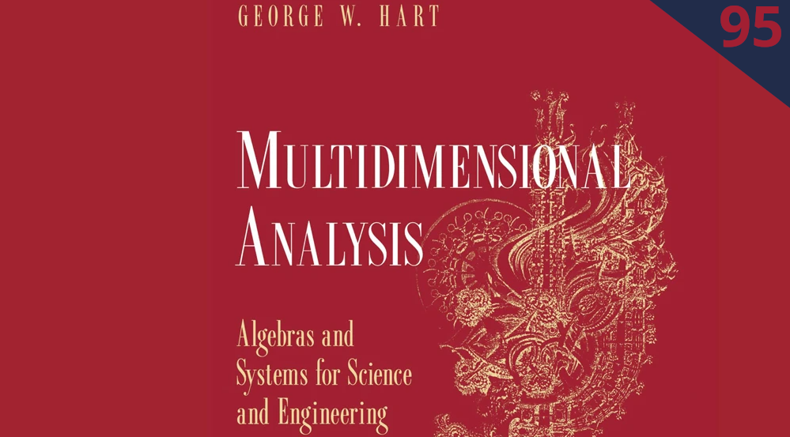
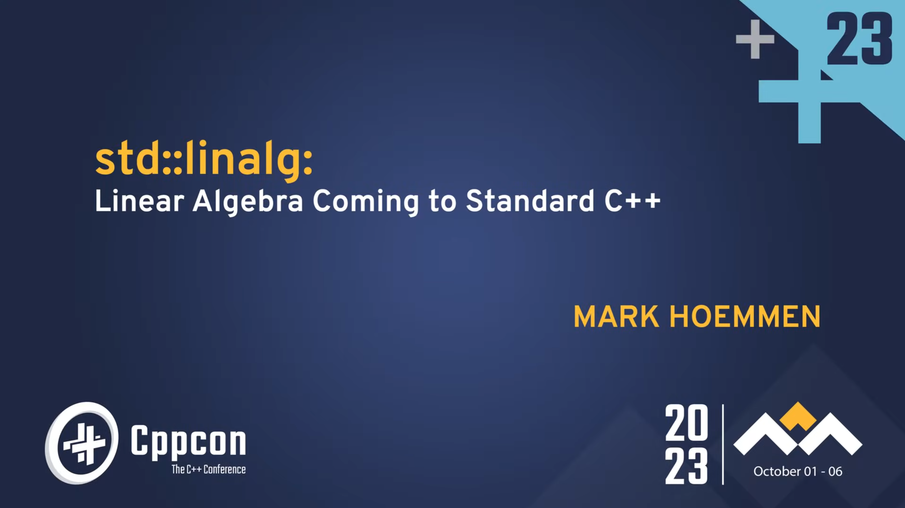
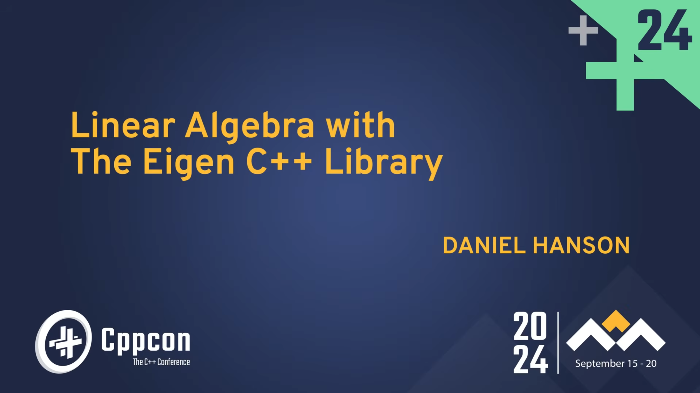
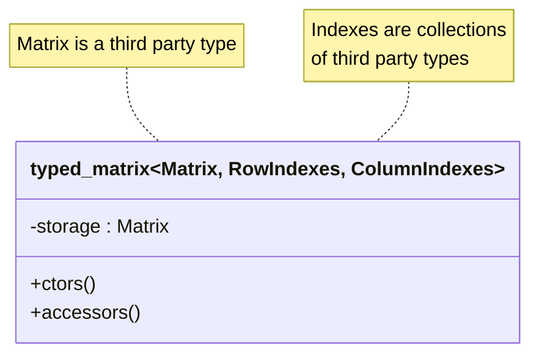

## Typed Linear Algebra

<small>François Carouge<br />
github.com/FrancoisCarouge</small>


<aside class="notes">
Hello, my name is François Carouge.
Thank you for inviting me to present in this December 2025 session of Cpp Bay Area.
Please interrupt me with your questions, or note down the slide number if you prefer to bring it up during the Q&A session at the end. Also let me know of any errors.
Today we are going to talk about yet another type of safety in programming languages. That would be quantity or unit safety with support of the C++ type system.
We will try to implement unit safety but in linear algebra applications. My objective is to share with you my practical learnings about type safe matrices.
I will follow a Problem → Idea → Solution → Takeaways progression.
You can find this talk and the full library on my GitHub at the location linked or by taking a picture of this QR code.
Let us start today with a real-world, motivating problem.
</aside>

---


<aside class="notes">
Do you know which launch this is?
Yes, it is the launch of the Mars Climate Orbiter probe. The launch took place in December 1998, the mission lasted 286 days for 327 million dollars.
Do you know how the mission terminated?
Yes, the program crashed, a mission failure, the Mars Climate Orbiter probe was lost to Mars.
The cause of the probe loss was an incorrect entry trajectory, 169 kilometers too close to Mars surface than calculated.
The cause of the incorrect trajectory was one software producing impulse vector results in pound-force seconds. Results fed to another software taking input in newton seconds. The unit difference meant an error factor of 4.45.
The producing software did not meet the interface specifications.
The specification, and then implementation, defect escaped to production due to additional causes including but not limited to, the lack of testing, verification, and validation contributed by economical pressure.
Back in these days the software ran on different machines in different geographical locations, and results from one software to another might have been transferred by emails. Extrapolating to present days this information exchange could be a function call away. I will let you decide for yourself and your project if such an issue should receive safety hardening from the type system. If you think it does, that is the problem for this talk: how to build a strongly typed linear algebra library: its data structures, vectors and matrices; and its algorithms. The objective is to facilitate the lifes of developers and enhance safety.
Let's talk about types first.
</aside>

---

```cpp
// Built-in types:
double run_duration_seconds{42.};
double building_height_meters{99.};
```

<span class="fragment">

```cpp
// Unit types:
std::chrono::seconds run_duration{42.}
quantity building_height{99. * m};
```

</span>

<aside class="notes">
We may find production code as shown that uses the built-in types to represent entities with additional meaning: the duration of a run in seconds or the height of building in meters.
The semantic of the variable is not encoded in its type. It is sometimes implicitely attached to the variable in its name. Or it is sometimes described in a comment somewhere. Or sometimes relies on the implicit convention of systematic usage of the internal system of units in a code base such that units are never identified explicitely. Consequently the tools cannot help in protecting users from invalid operations such as assiging a run time to a building height. Only the built-in type conversion are protected with compiler flags. The defect escapes the implementation stage and without tests, verifications, and other validations the probe crashes.
FRAGMENT. 
The second block of code however encode the units, dimensions in the type system itself. Invalid conversions, operations results in compiler errors, guiding the developers. Other benefits also include shorter variable names for readability. The type provides context.
There exists a variety of dimension libraries in C++, an example is that of `std::chrono` or other standardization efforts such as Mateusz Pusz's mp-units library and its quantity type here. We will use this quantity type in our examples.
Unfortunately unit and dimension are incomplete for a more comprehensive safe physical linear algebra! We will mostly talk about unit safety in this talk.
We will alude to additional safety capabilities to consider such as quantity kind, character
semantics, index access, or reference frame compatibility.
Now that we have aligned on quantity types, let's add in the linear algebra.
</aside>

---

```cpp
// Vector with built-in types:
vector v0{1., 2., 3.};
// std::vector<double>
// std::span<double, 3>
// Eigen::Vector<double, 3>
```

<span class="fragment">

```cpp
// Vector with unit types:
vector v0{1. * m, 2. * m, 3. * m};
// std::vector<quantity<m>>
// std::span<quantity<m>, 3> ?
// Eigen::Vector<quantity<m>, 3> ??
```

</span>

<span class="fragment">

```cpp
// Do as the built-in types?  double * double = double 🗸
//                            length * length = area   𐄂
```

</span>

<aside class="notes">
There exists a variety of linear algebra libraries in C++, the C++26 `std::linalg` combined with the C++23 `std::mdspan`, or higher order libraries such as Eigen.
A common data structure type found in linear algebra is that of a colum vector. So common that we will always call is a vector. Traditional representation of the linear algebra vector can be made with `std::vector`, C-arrays, `std::span` or an `Eigen::Vector`. Tradeoffs exists for sizes known at compile-time, or dynamically sized at run-time, owned memory or views over a range, and linear algebra operations availability. We will not focus much on the backend, instead we will strive for compatibility.
FRAGMENT
This second block of code shows what could be a first idea, a first attempt at typed linear algebra by using the quantity types in place of the built-in types.
Unfortunately all linear algebra operations and libraries have been designed with assumptions of built-in types. These assumptions do not hold for types with additional semantic.
FRAGMENT
For example, a double multiplied by a double gives you a double, but a length multiplied by a length gives you an area. Linear algebra operations fail to compile with the strongly typed vectors. Some approaches heavily modified the linear algebra libraries to support the strong types. It is only the begining of pain.
</aside>

---

```cpp
// Vector with heterogeneous unit types:
vector v0{1. * m, 2. * m / s, 3. * m / s2}; // ?
```

<span class="fragment">

```cpp
// Matrix with heterogeneous unit types:
matrix m0{{1. * m,     2. * m / s}, // ??
          {3. * m / s, 1. * m}};    // ??
```

</span>

<aside class="notes">
More difficulties arise when the linear algebra vectors have heterogenous types.
The existing linear algebra libraries are simply not equipped to allow such idiomatic code.
FRAGMENT
And finally, C++ itself seems to not permit constuction of heterogenous initializer-lists without additional syntaxic sugar.
Heterogenous initializer-lists tend to trigger internal compiler errors.
So what do we do now? Can we solve this problem with yet another level of indirection?
The idea is to use find an abstraction, preferably zero-cost, to provide to the user a composition of quantity types and linear algebra.
And down the rabbit hole of template metaprogramming we may go.
</aside>

---







<aside class="notes">
I found these references useful in preparing this library.
In 1878 the Bertrand-Buckingham π theorem proves linear systems can be rewritten in terms of a set of dimensionless parameters. Unfortunately usage in implementation is hardly systematic. Anyway the theorem does not help in exchanging physical algebraic information through interfaces.
In 1995 George Hart informs us on the mathematical properties of dimensioned quantities.
In 2002 Blair Hall identified conceptual elements of physical quantities applied to software frameworks. 
In 2020 Mateusz Pusz presents a C++ physical unit library.
In 2021 Chip Hogg shares C++ lessons about units in matrices.
In 2022 Daniel Withopf formalizes a C++ physical unit matrix.
In 2023 Mark Hoemmen presents C++ std::linalg based on a subset of the BLAS standard.
In 2024 Daniel Hanson showed us interoperability of Eigen and std::linalg.

Daniel Withopf and Chip Hogg inform us there already exists closed-source proprietary typed linear algebra.
And we can even find various open-source typed linear algebra attempts over the years.
We are trying to make a general, open-source, and permissive typed linear algebra library solution.
Let us now design the idea.
</aside>

---



<span class="fragment">

```cpp
template <typename Matrix,
          typename RowIndexes,
          typename ColumnIndexes>
class typed_matrix;
```

</span>

<aside class="notes">
The typed_matrix class unsurprisingly composes a third party linear algebra matrix type. This matrix type is injected through a template parameter.
Is that it? Surprisingly this so-called storage may not be so ordinary. We keep in mind it may need to support expression templates technique of the external type. We keep in mind it may own memory or only view memory.
The strong types of the matrix elements are encoded in a collection of types.
What types can be used to compose a collection of types?
Packs? Template template parameters? `std::tuple` may suffice.
Why are there two collections of types? Isn't one collection of N-times-M types sufficient to encode all the individual types of the matrix?
It interestingly turns out that encoding N-times-M types is quite complicated and unecesary. Blair Hall explained a conjecture from George Hart on the properties of physical quantity linear algebra: that is for all useful physical matrices N-plus-M types suffices to represent all the valid types of the matrix. Hence we will use two collections: one for the rows, one for the columns; the element of any given type being a factor at the intersection.
Additionaly, the typed_matrix must also support the superset of operations provided by the third partly linear algebra libraries and the standard library."
Lastly, the library needs to be decoupled from the linear algebra and quantity libraries. The template parameters help us in typed erasing the dependencies.
</aside>

---

<h6>Objective</h6>

```cpp
// Update the estimate uncertainty of a Kalman filter:
p = (i - k * h) * p * t(i - k * h) + k * r * t(k);

std::println("P: {}", p);
// P: [[8.92 m²,      5.95 m²/s,    1.98 m²/s²],
//     [5.95 m²/s,  503.98 m²/s², 334.67 m²/s³],
//     [1.98 m²/s², 334.67 m²/s³, 444.91 m²/s⁴]]
```

<aside class="notes">
A way to naively implement a Kalman filter in C++ is to transcribe its linear algebra equations in code. A linear algebra library like Eigen allows us to do this quite rapidly and yields simple code. We can evaluate the success of our prototype by implementing the estimate uncertainty update of a Kalman filter. The equation is a relatively simple yet non-trivial linear algebra exercise. It can be a useful and realistic benchmark. Now with a typed matrix linear algebra support, we can simply drop-in its replacement and guarantee the user provide input parameters have the correct dimensions at compile-time.
</aside>

---

```cpp
template <typename Matrix,
          typename RowIndexes,
          typename ColumnIndexes>
class typed_matrix {
```

<h6>Some Public Member Types</h6>

<span class="fragment">

```cpp
// Underlying data storage type:
using underlying = decltype(std::declval<Matrix>()(0,0));
```

</span>
<span class="fragment">

```cpp
// [i-th, j-th] element type:
template <int RowIndex,
          int ColumnIndex>
using element =
  product<std::tuple_element_t<RowIndex,
                               typename Matrix::row_indexes,
          std::tuple_element_t<ColumnIndex,
                              typename Matrix::column_indexes>>;
```

</span>

<aside class="notes">
There are a couple of useful member types to see in addition to the storage matrix type, the row indexes tuple, and the column indexes tuple member types not shown here because they merely are the template parameters.
FRAGMENT
A first interesting member type is the underlying data storage type, such as the floats or doubles of a matrix. It will be useful for the library itself and for end-users. We remember the backend is uniformely typed and as such the type of all of its underlying elements is that of the first element. We note the type erasure, the backend algebraic types whether Eigen or `std::mdspan` types will never leak into the library. Some `std::remove_cvref_t` have been removed for the readability of this slide. We will also not consider composed typed matrices within typed matrices at this time.
FRAGMENT
The second interesting member type is a template one. The strong type of the i-th, j-th element, for example the velocity in meter per seconds from the quantity library. Again  useful for the library itself and for end-users. The resulting type is formed by the result type of product of the i-th type of the row indexes by the j-th type of the column indexes. Importantly, note that the product template used here is not equivalent to the `std::multiplies` functional structure of the standard library. It is instead the resulting type of a multiplication that respect the strong types: the product of two lengths is an area, not simply the underlying storage type. This is an example of the standard library not considering strong type results. This alternative product type here is implemented in terms of the resulting type from invoking the call operator of a multiplication structure. These indirections allow for template specializations to resolve the varied use cases of template product types. 
</aside>

---

<h6>Member Variables</h6>

```cpp
// Sizes: static inline constexpr
int rows    = std::tuple_size_v<row_indexes>;
int columns = std::tuple_size_v<column_indexes>;

private:
// Underlying algebraic backend data:
Matrix storage;
```

<aside class="notes">
The count of rows and columns will also be useful as public member variables.
These members are static inline constexpr. We will omit all attribtutes (constexpr, nodiscard, and the occasional `std::remove_cvref_t`) in the slideware today for readability. The code is also slightly simplified at times, see the library on GitHub for the details. Please, fill in attributes as we go.
We will also not deal with dynamically sized matrices today.  
</aside>

---

<h6>Some Constructors</h6>

```cpp
// Safe default:
typed_matrix() requires std::default_initializable<Matrix>;

// Compatible copy conversion:
typed_matrix(const same_as_typed_matrix auto &other);

// Singleton matrix from convertible value.
typed_matrix(const auto &value)
  requires singleton_typed_matrix<typed_matrix>;

// Uniformly typed vector from array:
typed_matrix(const element<0, 0> (&elements)[rows * columns])
  requires uniform_typed_matrix<typed_matrix>
       and one_dimension_typed_matrix<typed_matrix>;
```

<aside class="notes">
The destructor is not shown here. You can imagine a default constexpr destructor.
Neither I will show the copy- and move- assignment operators equivalent to these constructors.
Matrices library made the choice of an unitialized default constructor for historical or performance reason. For a safer linear algebra library, it is appropriate to have a zero-initialized default constructor if the tyoe erased third party matrix type supports a default initialization.
The compatible copy conversion provide support for safely convertible but not strictly identical typed matrix. One example is that of a matrix where the rows and indexes types are merely transposed. Another example is that of the element types represent the same physical quantity type but the C++ template are not quite identical. Similarly for compatible move conversion. 
The singleton constructor helps the typed matrix to behavior more like built-in types where it can.
Lastly the constructor from an array is valid for uniform vectors
</aside>


---

<h6>Some Concepts</h6>

```cpp
template <typename Type> concept same_as_typed_matrix =
  std::same_as<Type, typed_matrix<typename Type::matrix,
                                  typename Type::row_indexes,
                                  typename Type::column_indexes>>;
```

</span>
<span class="fragment">

```cpp
template <typename Type> concept uniform_typed_matrix =
same_as_typed_matrix<Type> and ([]() { bool result{true};
  for_constexpr<0, Type::rows, 1>([&result](auto i) {
    for_constexpr<0, Type::columns, 1>([&result, &i](auto j) {
      result &= std::is_same_v<element<Type, i, j>,
                               element<Type, 0, 0>>;
    }); }); return result; }());
```

</span>

<aside class="notes">
The constructors of the typed matrix used concepts to ensure they are meanigful for a given template instantiation of a typed matrix. We show here a couple interesting concepts among the the 10 concepts present and used in the library.
In some cases, we want to enable behavior solely for typed matrices. This concept presented with an interesting challenge in its definition: the template parameters of the typed matrix could not be passed in the concept nor deduced. The neat idiom to permit usage of the concept while passing only the single type to check was to re-use the type's under evaluation for its member types. Note the Type parameter is found on both sides of the same type concept.
FRAGMENT
There will be constructors, members that are only valid, only enabled if the typed matrix is in the special case of a uniformely typed matrix. All element types are the same. The same? Is same type too restrictive? Wouldn't convertible types be a sufficient condition? But convertible to what? A common type? To one another? Exhaustively? Some questions remain open. Also note that the constexpr for or template for expression statement can often be re-written as a fold expression, we haven't found a practical nested fold expression equivalent to the nested for loops here.
</aside>

---

<h6>More Constructors</h6>

```cpp
// Uniformly typed matrix from init-list of init-list:
template <typename Type>
typed_matrix(
    std::initializer_list<std::initializer_list<Type>> row_list)
  requires uniform_typed_matrix<typed_matrix>;

// Vector from values:
typed_matrix(const auto &first_value,
             const auto &second_value,
             const auto &...values)
  requires one_dimension_typed_matrix<typed_matrix>;

// ! Underlying matrix conversion:
typed_matrix(const Matrix &other);
```

<aside class="notes">
We can at least provide a constructor accepting an initializer-list of initializer-list for a type giving a uniformly typed matrix.
And we can also provide an easy construction for a column or row vector of heterogeneous quantities. Note the parameter pack with two preceding mandatory parameter to disambiguate from other constructors.
The last constructor is a sharp edge. The tradeoffs are not always easy and so we may need to be able to construct a typed matrix from its underlying matrix type. This is helpful for implementing operations without friendship, or supporting expression templates. This is a problem.
</aside>

---

<h6>Some Accessors</h6>

```cpp
// Compile-time bound-checked typed element read/write:
template <int Row,
          int Column>
auto at() -> element<Row, Column> &
  requires (Row < rows)
       and (Column < columns);

// ! Subscript operator access:
auto &&operator[](this auto &&self, int row, int column)
  requires uniform_typed_matrix<typed_matrix>;

// ! Underlying data access:
auto &&data(this auto &&self);
```

<span class="fragment">

```cpp
}; // typed_matrix
```

</span>

<aside class="notes">
It seems the best we can do for type-safe compile-time bound-checked access is the standard `at` member, providing the i-th, j-th position as non-type template parameters. I omitted the atttributes nodiscard, constexpr, rvalue/lvalue/const variants of this member. I also omit the one dimension variation of the at member.
Next is the subscript operator, another sharp edge, here we see it with deducing this to deduplicate operators. The example shown here is that of the square bracket index operator. There is also the identical historical parentheses index operator not shown here. One difficulty with this operator is the lack of possibilities to provide compile-time bound checking. Another difficulty is that in C++ the return type is fixed at compile-time. We cannot vary the return type based on the element accessed at runtime. Therefore we limit this syntax to uniform matrices to preserve our type safety. This is a problem. It may be judicious to not support this accessor at all. Similarly for the parentheses-based index access operator not shown here.
Lastly we show the third and last sharp edge, the traditional underlying data accessor member function in the typical standard. Again this will be useful for implementing operations.
Compilers still had some difficulties with the deducing this syntax in this form here in addition to the decltype(auto) return types. Some of the compilers defects have been fixed in newer version and we may be able to reduce the duplication in the library.
FRAGMENT
And that's it for typed matrix class declaration, we will then see interesing implementations for some of these members and operations.
</aside>

---

<h6>at</h6>

```cpp
template <int Row,
          int Column>
auto at() -> element<Row, Column> &
  requires (Row < rows)
       and (Column < columns)
{
  return cast<element<Row, Column> &, underlying &>(
    storage(Row, Column));
}

// Usage:
m.at<1,2>() = 42. * s;
```

<aside class="notes">
The simplified implementation of the `at` member function shown here introduces the customization point object `cast`. This element caster objet allows the end-user to teach how the library can convert underlying type to and from quantity types. This single abstraction is the only place where the explicit conversions take place. For the mp-units quantity library the template specializations of the customization point use the explicit `numerical_value_in` quantity member function to obtain the underlying type value or inversely equip the underlying type value with the reference unit. Note the difficulties in preserving the value category of the type for rvalues and lvalues. Deducing this can be useful here.
</aside>

---

<h6>Some Algorithms</h6>

```cpp
auto operator+  (const same_as_typed_matrix auto &lhs,
                 const same_as_typed_matrix auto &rhs);
auto operator+  (const auto &lhs,
                 const singleton_typed_matrix auto &rhs)

auto operator*  (const same_as_typed_matrix auto &lhs,
                 const same_as_typed_matrix auto &rhs);

auto transposed (const same_as_typed_matrix auto &value);

void scale      (const auto &α,
                 same_as_typed_matrix auto &x);
```

<aside class="notes">
Adding algorithms, or operations against the typed matrix is merely done by adding functions. We've made the choice to avoid the friendship coupling to enable extensibility.
The first two operators, the additions, are two overloads amond four variations: adding two matrices, and adding a value to a 1-by-1 matrix. There are conditions on the types added, size of the matrix, convetibility of the types.
The matrix-matrix-product operator shown here is the general case product among six other overloads.
The matrix-matrix-divison operator, also has six overloads. It has the particularity to be configurable via yet another customization point object to select the end-user's prefered division implementation from a matrix decomposition solver. Matrix division divides the community. Pun intended. Should it exist? In which cases? Remember linear algebra is not commutative, a matrix may not have an inverse, and there may exists multiple different solutions to the same division.
The transposed operation shown here is not done in place.
The scale operation, alpha x, done in place here, imposes dimension less restrictions on the scalar, because the index types of the typed matrix are fixed.
All in all the library wants to provide a drop-in support for both Eigen and `std::linalg` matrix algorithms were possible.
</aside>

---

<h6>Matrix-Matrix Product</h6>

```cpp
auto operator*(const same_as_typed_matrix auto &lhs,
               const same_as_typed_matrix auto &rhs) {

// Type safety?

using row_indexes = product<lhs_row_indexes,
                      std::tuple_element_t<0, lhs_column_indexes>>;
using column_indexes = product<rhs_column_indexes,
                         std::tuple_element_t<0, rhs_row_indexes>>;

return make_typed_matrix<row_indexes, column_indexes>(
  lhs.data() * rhs.data());
}
```

<aside class="notes">
The matrix-matrix product shows a few of the techniques needed to implement the operations. The operations are totally external, no operations are member functions, no friendship.
The operations leverage ADL, overloads, and concepts to transparently select the most appropriate implementation.
Overloads for matrix-vector products, matrix-scalar products, singleton products are provided, not shown here.
This is the generic matrix-matrix product. Operations typically follows this idiomatic implementation: first verify linear algebra and type safety requirements, contracts, assertions; second express the return row and column index types; third and last perform the operation through the backend and using a factory function to decay and forward the resulting types while retaining the expression templates of the backend. 
For the matrix-matrix product, it appears that the resulting type is the matrix where the row index types are constituted by the product of the left-hand-side matrix row index types with the 0-th column type, and equivalently for the resulting column index types.
What do think you are some of the requirements, assertions, or contracts needed to ensure the matrix-matrix product is a correct and safe operation?
</aside>

---

<h6>Matrix-Matrix Product</h6>

```cpp
static_assert(lhs::columns == rhs::rows,
              "Matrix-matrix product requires compatible sizes.");
```

<aside class="notes">
A first requirement is that the shapes of the matrices are compatible.
The left-hand-side matrix needs as many columns as the number of rows of the right-hand-side matrix.
</aside>

---

<h6>Matrix-Matrix Product</h6>

```cpp
for_constexpr<0, lhs::rows, 1>([&](auto i) {
 using lhs_row = product<std::tuple_element_t<i, lhs_row_indexes>,
                         lhs_column_indexes>;
 for_constexpr<0, rhs::columns, 1>([&](auto j) {
  using rhs_column = product<rhs_row_indexes,
                    std::tuple_element_t<j, rhs_column_indexes>>;
  for_constexpr<0, lhs::columns, 1>([&](auto k) {
   static_assert(
    std::is_convertible_v<
     product<std::tuple_element_t<k, lhs_row>,
             std::tuple_element_t<k, rhs_column>>,
     product<std::tuple_element_t<0, lhs_row>,
             std::tuple_element_t<0, rhs_column>>>,
    "Matrix-matrix product requires compatible types.");});});});
```

<aside class="notes">
A second requirement is that each of the element products are compatible, convertible to their sums.
And we can see here a typical naive compile-time assertion over the types of the matrix-matrix product. One issue here is that the compiler error is unreadable when the user attempts an invalid product. Another issue is an apparent equivalent reimplementation of the underlying backend operation for the purpose of type verication, a good argument for the library backend to support strong types directly. 
</aside>

ADD ONE OR MORE SLIDES WITH EXAMPLES, MAYBE RECALL THE KALMAN FILTER?

---

<h6>Summary</h6>

<ul>
  <li>Composed Backend</li>
  <li>Forward Operations</li>
  <li>Inject Conversions</li>
  <li>Deducing This</li>
  <li>Constexpr For</li>
  <li>Expression Template</li>
</ul>


<aside class="notes">
To summarize our journey today.
We composed a matrix into a typed matrix to facade the physical quantity types.
The linear algebra operations are forwarded to their equivalent backend while enforcing the type safety.
End-user inject type conversion in a single customization point.
We leverage deducing this to provide a single implementation for the 2, 4, 8, 16 repetitive function versions.
We used template for expression statement to perform compile-time verification over vectors and matrices.
We kept the library transparent to third party expression template design.
</aside>

---

<h6>Opportunities</h6>

<ul>
  <li>Print Format</li>
  <li>Template For</li>
  <li>Compiler Compliance</li>
  <li>Benchmarking</li>
  <li>std::linalg</li>
  <li>Index Safety</li>
  <li>Frame Safety</li>
  <li>Taxonomy Safety</li>
</ul>

<aside class="notes">
The design presents many improvement opportunities.
A low hanging opportunity is the printing format which is a minimal implementation that follows the standard library default without any of its formatting options.
There may be opportunities to simplify the implementation with the C++26 template for expansion statement. 
Another opportunity is the library supports the latest versions of the three major compilers and the tip of the supporting libraries. Compatibility and stability is a fun challenge a number of bug reports and fixes have been generated in these projects.
Benchmarking is required to demonstrate the abstraction remains zero cost to enable adoption.
`std::linalg` in C++ 26 comes with many more operations to support. I wonder if reflection could help in generating the operation wrappers for the typed matrices.
I have reached a similar conclusion to Daniel Withopf presentation in 2022 that is, safe linear algebra with physical quantities require index safety. The at member should not use i, j indexes but strongly typed indexes encoding things like the reference frame, character of the quantity, or additional semantic. I suspect there exists an opportunity to implement index safety by yet another composition over the typed matrix, perhaps an indexed matrix.
Finally, there are Jacobian and Information matrices which may need an additional exponent for their type collections to differentiate their taxonomy in operations.
These are just a few of the next steps.
</aside>

---

## Typed Linear Algebra

<small>François Carouge<br />
github.com/FrancoisCarouge</small>


<aside class="notes">
I hope this talk will help you build safer linear algebra applications.
This QR code and link will take you to the library.
At this time I would welcome any question.
Thank you for participating today.
</aside>

---
